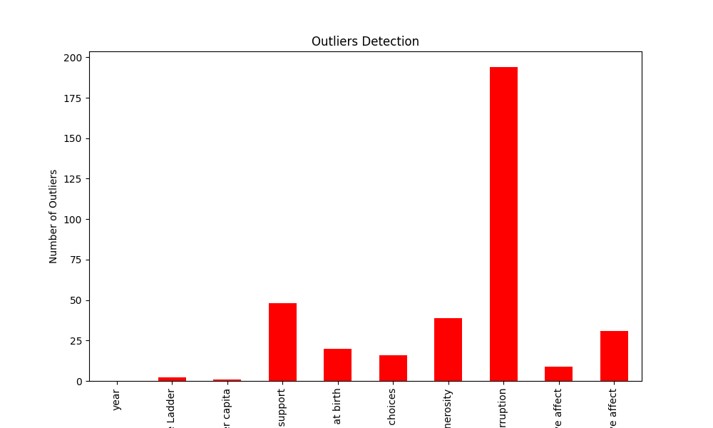

# Automated Data Analysis Report

## Introduction
This report provides a summary of the dataset, including key statistics, visualizations, and insights.

## Summary Statistics
|       |       year |   Life Ladder |   Log GDP per capita |   Social support |   Healthy life expectancy at birth |   Freedom to make life choices |     Generosity |   Perceptions of corruption |   Positive affect |   Negative affect |
|:------|-----------:|--------------:|---------------------:|-----------------:|-----------------------------------:|-------------------------------:|---------------:|----------------------------:|------------------:|------------------:|
| count | 2363       |    2363       |           2335       |      2350        |                         2300       |                    2327        | 2282           |                 2238        |       2339        |      2347         |
| mean  | 2014.76    |       5.48357 |              9.39967 |         0.809369 |                           63.4018  |                       0.750282 |    9.77213e-05 |                    0.743971 |          0.651882 |         0.273151  |
| std   |    5.05944 |       1.12552 |              1.15207 |         0.121212 |                            6.84264 |                       0.139357 |    0.161388    |                    0.184865 |          0.10624  |         0.0871311 |
| min   | 2005       |       1.281   |              5.527   |         0.228    |                            6.72    |                       0.228    |   -0.34        |                    0.035    |          0.179    |         0.083     |
| 25%   | 2011       |       4.647   |              8.5065  |         0.744    |                           59.195   |                       0.661    |   -0.112       |                    0.687    |          0.572    |         0.209     |
| 50%   | 2015       |       5.449   |              9.503   |         0.8345   |                           65.1     |                       0.771    |   -0.022       |                    0.7985   |          0.663    |         0.262     |
| 75%   | 2019       |       6.3235  |             10.3925  |         0.904    |                           68.5525  |                       0.862    |    0.09375     |                    0.86775  |          0.737    |         0.326     |
| max   | 2023       |       8.019   |             11.676   |         0.987    |                           74.6     |                       0.985    |    0.7         |                    0.983    |          0.884    |         0.705     |

## Missing Values
|                                  |   0 |
|:---------------------------------|----:|
| Country name                     |   0 |
| year                             |   0 |
| Life Ladder                      |   0 |
| Log GDP per capita               |  28 |
| Social support                   |  13 |
| Healthy life expectancy at birth |  63 |
| Freedom to make life choices     |  36 |
| Generosity                       |  81 |
| Perceptions of corruption        | 125 |
| Positive affect                  |  24 |
| Negative affect                  |  16 |

## Correlation Matrix

## Outliers Detection
|                                  |   0 |
|:---------------------------------|----:|
| year                             |   0 |
| Life Ladder                      |   2 |
| Log GDP per capita               |   1 |
| Social support                   |  48 |
| Healthy life expectancy at birth |  20 |
| Freedom to make life choices     |  16 |
| Generosity                       |  39 |
| Perceptions of corruption        | 194 |
| Positive affect                  |   9 |
| Negative affect                  |  31 |

## Distribution of Data

## Conclusion
This analysis highlights key patterns and insights in the dataset.
## Data Story
The data analysis provides a comprehensive overview of various factors influencing subjective well-being across countries, as reflected by the "Life Ladder" metric. This metric can be interpreted as a measure of subjective happiness or life satisfaction. The dataset spans from 2005 to 2023, with 2363 observations, showcasing significant insights into the relationship between economic, social, and psychological factors.

### Summary of Key Findings

1. **General Trends**: 
   - The average Life Ladder score is approximately **5.48**, with a standard deviation of **1.13**. This indicates a moderate level of life satisfaction across the sample. The scores range from a minimum of **1.28** to a maximum of **8.02**, highlighting substantial variability in well-being perceptions across different countries and contexts.

2. **Economic Factors**: 
   - The correlation between the Life Ladder and Log GDP per capita is notably strong (r = **0.78**), suggesting that higher economic output per person tends to correlate with higher life satisfaction. This is further supported by a similarly strong correlation with Social Support (r = **0.72**) and Healthy Life Expectancy (r = **0.71**). These findings underscore the importance of economic stability and health in influencing overall happiness.

3. **Social Capital**: 
   - Social support also plays a critical role, with a mean score of **0.81**. The 75th percentile indicates that in many regions, social support significantly contributes to life satisfaction. Additionally, Freedom to make life choices (mean = **0.61**) has a positive correlation with life satisfaction (r = **0.54**), reinforcing the idea that personal autonomy is a key component of happiness.

4. **Psychological Factors**: 
   - Positive affect (mean = **0.65**) and negative affect (mean = **0.27**) show that emotional well-being is intricately connected to life satisfaction. The correlation matrix reveals that positive affect is positively linked to life satisfaction (r = **0.51**), while negative affect shows a negative correlation (r = **-0.35**), indicating that higher levels of positive emotions and lower levels of negative emotions contribute to higher life satisfaction.

5. **Corruption and Generosity**:
   - Perceptions of corruption have a significant negative correlation with life satisfaction (r = **-0.43**), suggesting that countries with higher corruption perceptions tend to have lower life satisfaction. On the other hand, generosity shows a weaker relationship (r = **0.18**), indicating that while charitable behavior may contribute to well-being, it is less impactful than economic and social factors.

### Missing Values and Outliers

The dataset has some missing values, particularly in Log GDP per capita (28 missing), Social support (13 missing), and several other variables. Outliers were identified in several metrics, including **48 outliers in social support** and **194 in perceptions of corruption**, which may skew interpretations and warrant further investigation.

### Conclusion

This data analysis elucidates the multifaceted determinants of life satisfaction across nations, emphasizing the intertwined nature of economic prosperity, social support, health, and psychological well-being. To enhance life satisfaction, policymakers should focus not only on economic growth but also on fostering social support systems, reducing corruption, and promoting individual freedoms. Overall, these findings can guide future research and interventions aimed at improving quality of life on a global scale.